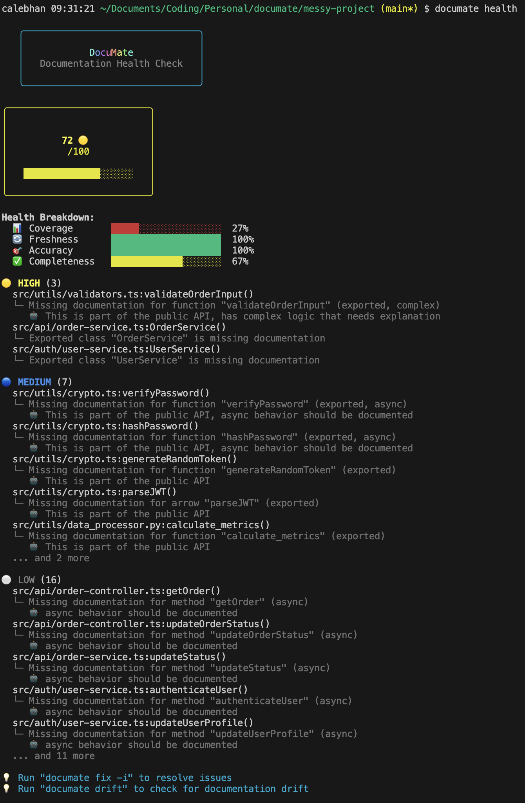

# DocuMate

> AI-powered documentation analysis and generation for TypeScript projects

DocuMate is a CLI tool that helps maintain high-quality code documentation by analyzing your TypeScript codebase, identifying documentation gaps, detecting drift, and generating JSDoc comments using GitHub Copilot.

## Demo

<p align="center">
  
  <br>
  <em>DocuMate's documentation health dashboard powered by GitHub Copilot CLI</em>
</p>

## Features

- **📊 Documentation Scanning** - Analyze TypeScript, JavaScript, Python, and Markdown files to detect documented and undocumented code
- **💯 Health Scoring** - Calculate documentation health based on coverage, completeness, freshness, and accuracy
- **🔍 Drift Detection** - Find code that changed without corresponding documentation updates in both code and markdown files
- **✨ AI Generation** - Generate JSDoc comments and markdown documentation using GitHub Copilot CLI (optional)
- **🔧 Interactive Fixes** - Guided workflow to review and apply documentation fixes
- **💬 Chat Mode** - Conversational AI assistant for documentation questions
- **📈 Debt Analysis** - Prioritize undocumented code by visibility, complexity, and impact
- **📊 Session Metrics** - Track Copilot API usage, cache hit rates, and performance statistics
- **🔍 Explain Mode** - See exactly what prompts are sent to Copilot and what responses are received
- **🌐 Multi-Language Support** - TypeScript, JavaScript (.ts, .tsx, .js, .jsx), Python (.py), and Markdown (.md)

## Installation

```bash
# Clone the repository
git clone https://github.com/calebyhan/documate.git
cd documate

# Install dependencies
npm install

# Build the project
npm run build

# Link for global use
npm link

# Or run directly with tsx
npm run dev -- --help
```

## Quick Start

```bash
# Scan your project
documate scan src/

# Check documentation health
documate health

# Find documentation drift
documate drift

# Interactive fix session
documate fix -i

# Generate docs for a specific file
documate generate src/myfile.ts -i

# Generate markdown documentation
documate generate docs/api.md --type api -i

# Chat with DocuMate
documate chat

# Initialize configuration
documate config --init
```

**Global Options** (work with any command):
```bash
# Show Copilot prompts and responses for transparency
documate <command> --explain

# Display session metrics after command execution
documate <command> --stats

# Examples:
documate drift --explain --stats
documate scan src/ --stats
documate health --explain
```

## Commands

### `documate scan [path]`

Scan TypeScript, JavaScript, Python, and Markdown files to analyze documentation coverage.

**Options:**
- `--verbose` - Show detailed output
- `--json` - Output results as JSON

**Supported Files:**
- TypeScript/JavaScript: `.ts`, `.tsx`, `.js`, `.jsx`
- Python: `.py`
- Markdown: `.md`

**Example:**
```bash
documate scan src/
documate scan .                                    # Scan current directory
documate scan src/auth/user-service.ts --verbose
documate scan --json > report.json                # Export as JSON
```

### `documate health`

Calculate and display documentation health score based on:
- **Coverage** (30%): Percentage of documented functions
- **Freshness** (30%): Documentation up-to-date with code changes
- **Accuracy** (20%): Examples and descriptions match current API
- **Completeness** (20%): Quality of documentation (params, returns, examples)

**Example:**
```bash
documate health
```

### `documate drift`

Detect code changes without corresponding documentation updates using git history. Analyzes both code files and markdown documentation.

**Options:**
- `-f, --file <path>` - Analyze a specific file
- `--commits <number>` - Number of commits to analyze (default: 10)
- `--since <date>` - Check drift since specific date
- `--verbose` - Show detailed output

**Example:**
```bash
documate drift
documate drift --commits 20
documate drift --file src/utils/helpers.ts
documate drift --since "2024-01-01"
```

### `documate fix`

Fix documentation issues with AI assistance.

**Options:**
- `--interactive, -i` - Interactive mode with review/apply workflow

**Example:**
```bash
documate fix           # Show issues summary
documate fix -i        # Interactive fix session
```

### `documate generate <target>`

Generate documentation for code files or create markdown documentation.

**For Code Files:**
Generate JSDoc/TSDoc comments for undocumented functions.

**For Markdown Files:**
Generate API reference or architecture documentation based on your codebase.

**Options:**
- `-s, --style <style>` - Documentation style: `jsdoc` (default) or `tsdoc` (for code)
- `-t, --type <type>` - Generation type: `api` or `architecture` (for markdown)
- `-i, --interactive` - Review and apply interactively
- `--verbose` - Show detailed output

**Examples:**
```bash
# Generate JSDoc for undocumented functions in a file
documate generate src/utils/helpers.ts -i

# Generate docs for a specific function
documate generate src/auth/service.ts:authenticateUser -i

# Generate markdown API reference
documate generate docs/api.md --type api -i

# Generate architecture overview
documate generate docs/architecture.md --type architecture -i
```

### `documate chat`

Start an interactive chat session with DocuMate AI assistant.

**Example:**
```bash
documate chat
```

### `documate config`

Manage DocuMate configuration.

**Options:**
- `--init` - Initialize new configuration file
- `--show` - Display current configuration

**Example:**
```bash
documate config --init
documate config --show
```

## Configuration

DocuMate uses a `.documate.json` configuration file in your project root:

```json
{
  "documentation": {
    "style": "jsdoc",
    "includeExamples": true,
    "includeTypes": true
  },
  "scan": {
    "include": ["src/**/*.ts"],
    "exclude": ["**/*.test.ts", "**/*.spec.ts", "**/node_modules/**"]
  },
  "health": {
    "coverageWeight": 0.3,
    "freshnessWeight": 0.3,
    "accuracyWeight": 0.2,
    "completenessWeight": 0.2,
    "minScore": 80
  },
  "copilot": {
    "enabled": true,
    "timeout": 30000
  }
}
```

**Configuration Options:**

- `documentation.style` - JSDoc or TSDoc format
- `documentation.includeExamples` - Generate @example blocks
- `documentation.includeTypes` - Include @param and @returns type info
- `scan.include` - Glob patterns for files to scan (supports `.ts`, `.tsx`, `.js`, `.jsx`, `.py`, `.md`)
- `scan.exclude` - Glob patterns to ignore
- `health.*Weight` - Adjust health score calculation weights (must sum to 1.0)
- `health.minScore` - Minimum acceptable health score (0-100)
- `copilot.enabled` - Use GitHub Copilot for AI features
- `copilot.timeout` - Copilot request timeout in milliseconds

## GitHub Copilot Integration

DocuMate optionally integrates with GitHub Copilot CLI for AI-powered features:

**Prerequisites:**
1. Install GitHub CLI: `brew install gh` (macOS) or [other platforms](https://cli.github.com/)
2. Install Copilot extension: `gh extension install github/gh-copilot`
3. Authenticate: `gh auth login`

**Features using Copilot:**
- Semantic drift analysis (understanding code meaning changes)
- Context-aware documentation generation
- Interactive chat mode
- Fix suggestions

**Fallback:** All features work without Copilot using template-based generation and heuristic analysis.

### Transparency & Debugging

DocuMate provides two global options (see [Quick Start](#quick-start)) for transparency and debugging:

**Explain Mode** (`--explain`): See exactly what DocuMate sends to Copilot and what it receives back. Works with any command.

```bash
documate drift --explain

# Shows detailed output:
# 🤖 GitHub Copilot CLI - Explain Mode
# ━━━━━━━━━━━━━━━━━━━━━━━━━━━━━━━━━━━━━━━━━━━━━━━━━━━━
# 📤 Prompt sent to Copilot:
# [Full prompt text...]
# ━━━━━━━━━━━━━━━━━━━━━━━━━━━━━━━━━━━━━━━━━━━━━━━━━━━━
# 📥 Copilot response:
# [Full response...]
```

**Session Metrics** (`--stats`): Track Copilot usage, performance, and analysis statistics. Works with any command.

```bash
documate scan src/ --stats

# After command completes:
# ─────────────────────────────────────────────────────────
# 📊 Session Metrics
#
# 🤖 GitHub Copilot:
#    Total API calls: 15
#    Cache hits: 3 (20%)
#    Failed calls: 0
#    Average response time: 1247ms
#    Explain calls: 10
#    Suggest calls: 5
#
# 📈 Analysis:
#    Files scanned: 42
#    Functions analyzed: 156
#    Semantic changes detected: 8
#    Drift issues found: 12
#
# ⏱️  Session duration: 23s
```

## Testing with Messy Project

A sample `messy-project/` is included for testing DocuMate's capabilities:

```bash
# Scan the messy project
documate scan messy-project/src

# Expected results:
# - Coverage: ~20-25%
# - Health Score: 30-40/100
# - 20+ undocumented functions
# - Multiple critical priority issues

# Check health
documate health

# Find drift and outdated examples
documate drift

# Interactive fix
documate fix -i

# Generate docs for fully undocumented file
documate generate messy-project/src/utils/crypto.ts -i
```

The messy-project includes:
- Completely undocumented utility modules
- Outdated @example blocks
- Missing docs for critical public methods
- Complex functions without documentation
- Various TypeScript patterns (classes, functions, async, arrow functions)

## Development

```bash
# Run in development mode
npm run dev -- scan src/

# Build TypeScript
npm run build

# Run tests
npm test

# Run tests in watch mode
npm run test:watch

# Type checking
npx tsc --noEmit
```

## Project Structure

```
documate/
├── src/
│   ├── cli/
│   │   ├── commands/       # Command implementations
│   │   ├── ui/             # UI components and views
│   │   └── index.ts        # CLI entry point
│   ├── core/
│   │   ├── analyzers/      # Health, debt, drift analyzers
│   │   ├── generators/     # Documentation generators
│   │   ├── scanners/       # TypeScript AST scanners
│   │   └── validators/     # Example validators
│   ├── copilot/
│   │   ├── wrapper.ts      # GitHub Copilot CLI wrapper
│   │   ├── prompts.ts      # AI prompt templates
│   │   └── parsers.ts      # Response parsing
│   ├── integrations/
│   │   └── git.ts          # Git history analysis
│   ├── utils/              # Config, logger, file system
│   └── types/              # TypeScript type definitions
├── tests/
│   └── fixtures/           # Test files
├── messy-project/          # Sample project for testing
└── docs/                   # Design documentation
```

## Architecture Highlights

- **Pure ESM** - Modern ES modules throughout (chalk v5, ora v8, inquirer v12)
- **TypeScript AST Parsing** - Uses `ts.createSourceFile()` for fast, lightweight parsing
- **Subprocess Wrapper** - Integrates GitHub Copilot CLI via child process
- **Multi-Strategy Parsing** - Robust JSON extraction from AI responses
- **Git Integration** - Uses simple-git for history and diff analysis
- **Scan Caching** - Results saved to `.documate/scan-results.json` for cross-command use
- **Interactive Workflows** - Inquirer-based prompts for user-friendly CLI experience

## Contributing

Contributions welcome! This is a greenfield project built from the ground up.

## License

See [LICENSE](LICENSE) file.

## Roadmap

- [x] Support JavaScript files
- [x] Python support (.py files)
- [x] Markdown documentation analysis
- [x] Basic unit tests
- [ ] Expand test coverage
- [ ] Additional language support (Go, Rust, Java via tree-sitter)
- [ ] VS Code extension
- [ ] CI/CD integration (GitHub Actions, GitLab CI)
- [ ] HTML report generation with charts and graphs
- [ ] Custom documentation templates
- [ ] Team collaboration features (shared configs, team metrics)
- [ ] Documentation metrics dashboard (web UI)
